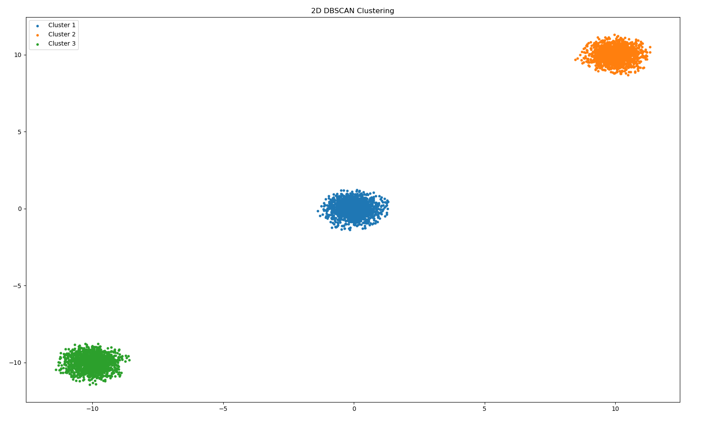
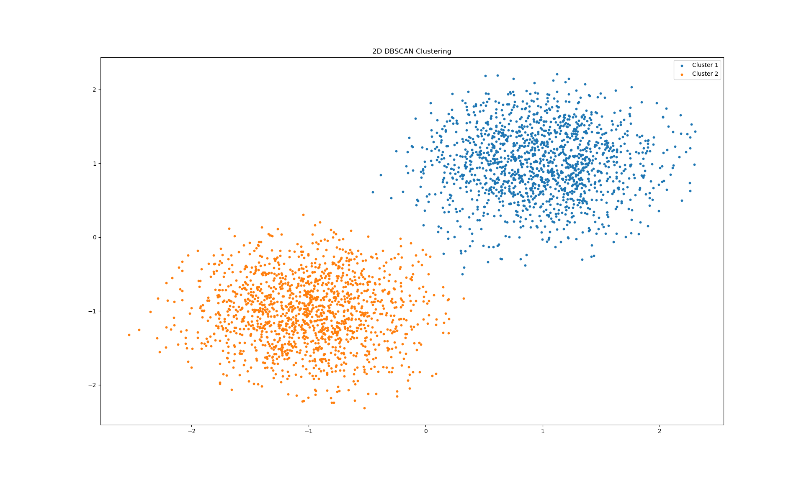

# Create a Workload Analysis Flow Using RISC-V Olympia Performance Model

## Coding Challenge
Here is the question for reference: 
```
Given a sequence of N-dimensional data,
write a program to group these data into multiple clusters.
Make reasonable choices to decide how to cluster as well as how many clusters.
Discuss any trade-offs involved.
```
This problem can be broken into two parts. I will answer each separately:

### Defining the problem
To associate data points we need a metric which tells us how close these points are. Hence we would like to define a function:

$f(p_1, p_2) \rightarrow  \Re$ where $p_1 \subset Dataset$ and $p_2 \subset Dataset$. 

$p_1$ and $p_2$ are N-dimensional points belonging to the dataset. The function definition should encode all the properties of the data. Some examples for $f(p_1, p_2)$:

1. Euclidean distance: If the data is numerical, depending on the application Euclidean or manhattan distances are a good metric. Example:
    * We want to cluster white lane points from a pointcloud received from a sensor like a LiDAR or stereocamera, distance is the best way to define $f$ for this use case. 
2. String encoding: If the data is a string, we need to be smart when defining $f$. The implementation would depend on the exact problem statement but here are some encodings one could use.
    * We want to group words based on their pronunciation. A simple algorithm would be to define distances of phrases upto 3 letters. Example: "dou" and "da" sound similar and can be assigned a smaller distance. Once we have a table of these distances we can find distances of bigger words by splitting them into 3 word phrases. Generating the distance for the smaller phrases can either be done manually or hamming distance.
    * LLMs use tokenization to transform sentences to N dimensional vectors. This can be studied as well.

Defining the problem requires in depth knowledge about the domain and thus there is no general function that can acheive this. Yet I have tried to highlight a few ideas one can use while defining the distance function.


### Clustering the points
There are many algorithms to cluster points. I have implemented DBSCAN( Density Based Spatial Clustering ). This algorithm takes two hyperparameters: $\epsilon$ and ```min_pts```.

$\epsilon$ - Threshold to consider two points as being close to each other.

```min_pts``` - Number of neighbors required to consider a point as a core point. Points not satisfying this criteria are "noise points".

### Drawbacks
1. We cannot set the number of clusters explicitly. However, in my experience I have found that tuning $\epsilon$ and ```min_pts``` properly gives a general bound on the number of clusters formed.
2. The algorithm is slow. $O(n^2)$ in time complexity and $O(n^2)$ in space complexity. However this can be sped up by using parallel hardware like GPUs.

I have used CUDA C++ to speed up the algorithm significantly. It works for general N-dimensional points.

here's a demo:




